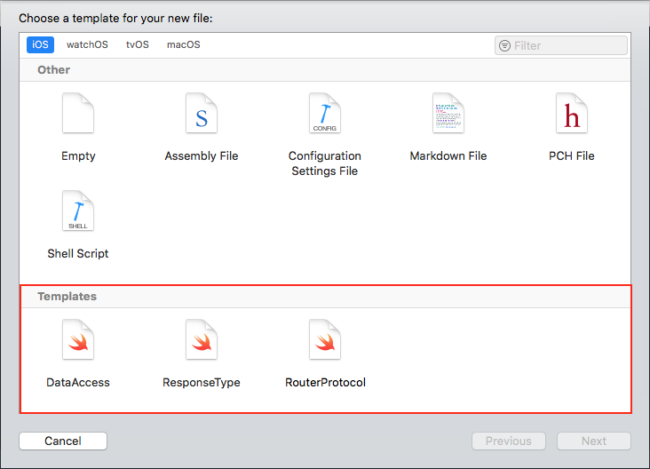

# AlamofireTemplates
This is 3 Xcode Files Templates based on the [Alamofire Router](https://github.com/Alamofire/Alamofire/blob/master/Documentation/AdvancedUsage.md#api-parameter-abstraction) & [AlamofireObjectMapper](https://github.com/tristanhimmelman/AlamofireObjectMapper).

## Installation
Just drop the `Templates` folder to `~/Library/Developer/Xcode/`
